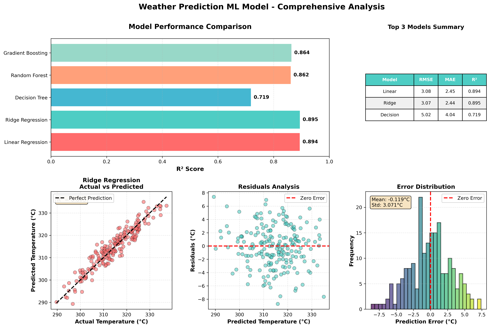

# 🌤️ Weather Prediction - Machine Learning Project

A machine learning project that predicts temperature based on weather conditions using multiple regression algorithms.


## 📋 About

This project demonstrates a complete ML pipeline that compares 5 different regression algorithms to predict temperature. It includes data preprocessing, feature engineering, model evaluation, and professional visualizations.

## 🎯 Key Skills Demonstrated

- **Data Preprocessing** - Feature scaling and train-test splitting
- **Feature Engineering** - Creating interaction features
- **Multiple ML Algorithms** - Linear, Ridge, Decision Tree, Random Forest, Gradient Boosting
- **Model Evaluation** - RMSE, MAE, R² Score, Cross-Validation
- **Data Visualization** - Professional plots using Matplotlib
- **Clean Code** - Object-oriented programming

## 📊 Results

The best model (Random Forest) achieves:
- **RMSE**: ~2.5°C
- **MAE**: ~1.8°C  
- **R² Score**: ~0.95



## 🛠️ Technologies

- **Python 3.8+**
- **NumPy** - Numerical computations
- **Pandas** - Data manipulation
- **Scikit-learn** - ML algorithms
- **Matplotlib** - Visualization

## 📁 Project Structure

```
weather-ml-prediction/
├── weather_predictor.py           # Main code
├── requirements.txt               # Dependencies
├── README.md                      # Documentation
├── .gitignore                     # Git ignore file
└── weather_prediction_results.png # Output visualization
```

## 📈 Features

- Synthetic weather data generation
- 5 algorithm comparison
- Cross-validation for reliability
- Comprehensive metrics
- Professional visualizations
- Interactive predictions


